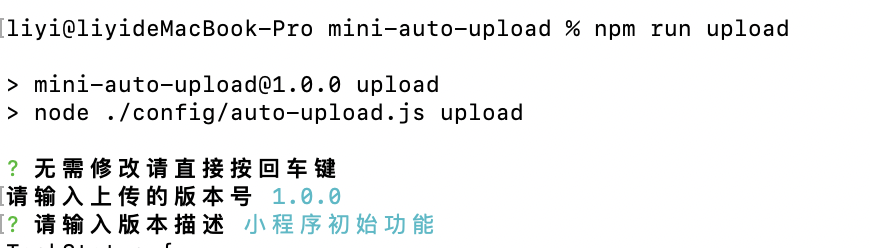
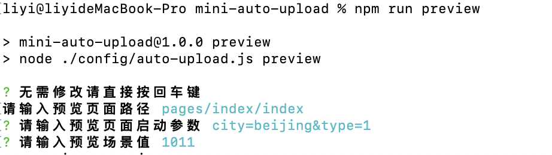

# 微信小程序自动化部署
交互式命令行,灵活配置部署参数.

## 开发环境
node 16.14.0

## 命令
upload:代码上传
preview:代码预览,输出预览二维码图片

## 目录
- config
- |------auto-upload.js 自动化部署脚本
- |------private.wx123456789.key 小程序代码上传秘钥
- |------preview.png 预览二维码

## 运行示例
`npm run upload`

`npm run preview`
